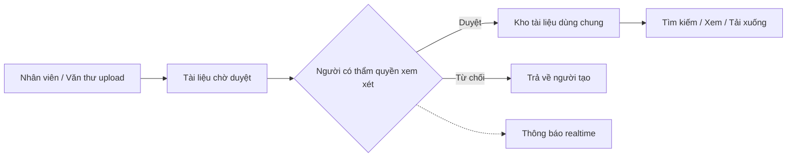
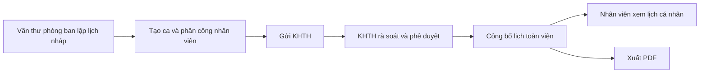
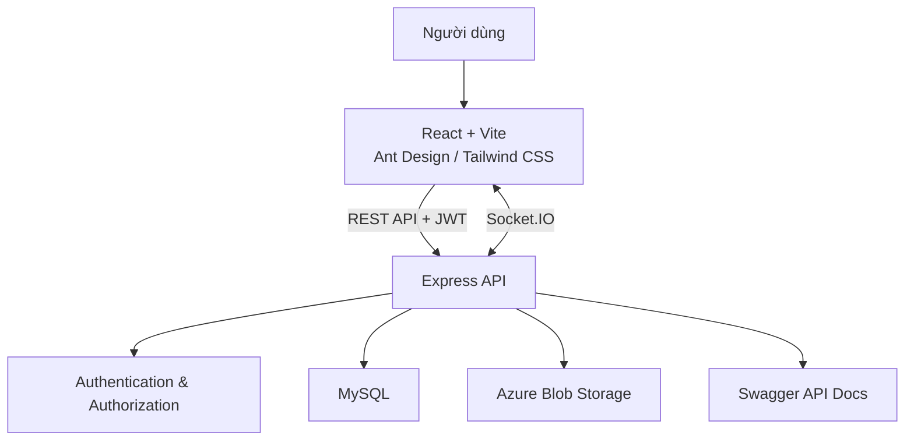

# Hệ thống Quản lý Bệnh viện Thái An

<div align="center">
  
</div>

<p align="center">
  Nền tảng web nội bộ giúp bệnh viện quản lý tài liệu, quy trình phê duyệt, lịch trực và lịch công tác tuần trên một hệ thống thống nhất.
</p>

<p align="center">
  <strong>React 19</strong> · <strong>Node.js / Express</strong> · <strong>MySQL</strong> · <strong>Azure Blob Storage</strong> · <strong>Socket.IO</strong>
</p>

## Tổng quan dự án

Hệ thống được xây dựng cho môi trường bệnh viện có nhiều phòng ban và nhiều cấp nghiệp vụ. Mỗi người dùng chỉ nhìn thấy menu và thao tác phù hợp với **vai trò**, **phạm vi phòng ban/toàn viện**, **trạng thái dữ liệu** và **quyền sở hữu**.

### Điểm nổi bật

- Quản lý tập trung người dùng, phòng ban, tài liệu và lịch làm việc.
- Phân quyền RBAC với 6 nhóm vai trò và scope theo phòng ban/toàn bệnh viện.
- Quy trình duyệt rõ ràng cho tài liệu và lịch trực, có kiểm tra quyền ở cả frontend lẫn backend.
- Lưu trữ file trên Azure Blob Storage; hỗ trợ Word, Excel, PDF và hình ảnh.
- Thông báo thời gian thực bằng Socket.IO khi tài liệu được gửi, duyệt hoặc từ chối.
- Dashboard trực quan với số liệu tổng hợp, biểu đồ tròn, biểu đồ cột và thống kê theo phòng ban.
- Xuất lịch trực/lịch công tác tuần ra PDF.
- API có Swagger, validation, JWT, rate limiting, Helmet và bộ kiểm thử Jest/Playwright.

## Chức năng chính

| Phân hệ | Chức năng |
| --- | --- |
| **Tổng quan** | Thống kê người dùng, phòng ban, tài liệu, lịch đã duyệt; phân tích tài liệu theo loại file và phòng ban. |
| **Người dùng** | Tạo, cập nhật, tìm kiếm, khóa/mở khóa tài khoản; gán vai trò và phòng ban. |
| **Phòng ban** | Quản lý thông tin phòng ban và thành viên; hỗ trợ nhóm thường, hành chính và đặc thù. |
| **Tài liệu** | Upload file, gắn danh mục/phòng ban, xem chi tiết, tìm kiếm, tải xuống, cập nhật và xóa theo quyền. |
| **Phê duyệt tài liệu** | Trưởng phòng hoặc người có thẩm quyền duyệt/từ chối tài liệu đang chờ; theo dõi người và thời điểm duyệt. |
| **Lịch trực phòng ban** | Văn thư phòng ban lập lịch theo tuần, tạo ca sáng/chiều/đêm, phân công nhân viên và gửi KHTH. |
| **Lịch trực toàn viện** | KHTH tiếp nhận lịch từ các phòng, rà soát, phê duyệt/công bố và xuất PDF. |
| **Lịch công tác tuần** | KHTH tạo hoạt động theo ngày/buổi, địa điểm, nội dung, thành phần tham dự và công bố toàn viện. |
| **Lịch cá nhân** | Nhân viên xem các ca trực và công việc tuần đã được duyệt có liên quan đến mình. |
| **Hồ sơ cá nhân** | Xem/cập nhật thông tin tài khoản và đổi mật khẩu. |

## Giao diện

Giao diện sử dụng Ant Design kết hợp Tailwind CSS, bố cục dashboard với sidebar cố định và menu tự thay đổi theo quyền của người đang đăng nhập.

| Màn hình | Nội dung nổi bật |
| --- | --- |
| **Đăng nhập** | Banner bệnh viện, form đăng nhập và điều hướng trở lại trang người dùng đang truy cập. |
| **Dashboard** | Thẻ KPI, thống kê Word/Excel/PDF/Image, bảng dữ liệu phòng ban, biểu đồ tròn và biểu đồ cột responsive. |
| **Kho tài liệu** | Bảng tài liệu đã duyệt, tìm kiếm, xem metadata, tải file và các hành động theo quyền. |
| **Duyệt tài liệu** | Danh sách tài liệu chờ xử lý, modal xem chi tiết, thao tác duyệt hoặc từ chối. |
| **Lịch trực phòng ban** | Workspace theo tuần, bảng ca trực, bộ chọn nhân viên và hành động gửi lịch cho KHTH. |
| **Lịch trực toàn viện** | Tách danh sách chờ duyệt/đã công bố, xem lịch tổng hợp và tải PDF. |
| **Lịch công tác tuần** | Quản lý công việc theo ngày và buổi; hiển thị nội dung, địa điểm và người tham gia. |
| **Quản trị** | Bảng quản lý người dùng/phòng ban, form thêm-sửa và trạng thái hoạt động. |

## Vai trò và quyền hạn

| Vai trò | Phạm vi nghiệp vụ chính |
| --- | --- |
| **ADMIN** | Quản trị toàn hệ thống, người dùng, phòng ban; có quyền truy cập nghiệp vụ tổng thể. |
| **HOSPITAL_CLERK** | Quản lý tài liệu ở phạm vi toàn bệnh viện. |
| **HEAD_OF_DEPT** | Quản lý nghiệp vụ trong phòng ban và phê duyệt tài liệu của phòng. |
| **DEPT_CLERK** | Upload tài liệu, lập và gửi lịch trực của phòng ban. |
| **STAFF** | Xem tài liệu, lịch được công bố và lịch cá nhân; upload tài liệu theo quyền. |
| **KHTH** | Tổng hợp/phê duyệt lịch trực và quản lý lịch công tác tuần toàn viện. |

Quyền thực tế được xác định theo công thức:

```text
Quyền thao tác = Vai trò + Phạm vi + Trạng thái dữ liệu + Quyền sở hữu
```

## Luồng nghiệp vụ

### Phê duyệt tài liệu



### Lịch trực



## Kiến trúc hệ thống



Backend được tổ chức theo các lớp `routes → middleware → controllers/services → models → database`. Frontend tách page, component, hook và service API; riêng phân hệ lịch có module dùng chung cho truy vấn, quyền, bảng lịch và xuất PDF.

## Công nghệ sử dụng

| Nhóm | Công nghệ |
| --- | --- |
| **Frontend** | React 19, Vite 7, React Router, Ant Design, Tailwind CSS, Lucide React, Recharts |
| **Data fetching** | Axios, TanStack Query |
| **Backend** | Node.js, Express, JWT, Joi, express-validator |
| **Database** | MySQL 8, migration SQL, `mysql2` connection pool |
| **Lưu trữ** | Azure Blob Storage, Multer |
| **Realtime** | Socket.IO |
| **Tài liệu / báo cáo** | Swagger/OpenAPI, PDFKit, XLSX |
| **Bảo mật** | bcryptjs, Helmet, CORS, rate limiting, role/scope authorization |
| **Kiểm thử** | Jest, Supertest-style controller/service tests, Playwright E2E |

## Cấu trúc thư mục

```text
Hospital_Management_Web/
├── FE/                         # React frontend
│   ├── e2e/                    # Playwright end-to-end tests
│   └── src/
│       ├── components/         # Layout, sidebar, protected routes...
│       ├── context/            # Authentication context
│       ├── hooks/              # Auth và Socket.IO hooks
│       ├── modules/schedule/   # UI, API, hooks và tiện ích của lịch
│       ├── pages/              # Dashboard, admin, tài liệu, lịch
│       └── services/           # HTTP service layer
├── BE/                         # Express backend
│   ├── database/               # Schema, migration runner và migrations
│   ├── docs/                   # Tài liệu kỹ thuật chuyên sâu
│   ├── scripts/                # Setup DB, seed E2E, rollout dữ liệu
│   ├── src/
│   │   ├── config/             # MySQL, Azure, Swagger
│   │   ├── controllers/        # Request handlers
│   │   ├── middleware/         # Auth, phân quyền, upload, validation
│   │   ├── models/             # Data access models
│   │   ├── routes/             # REST API routes
│   │   ├── services/           # Nghiệp vụ lịch và xuất PDF
│   │   └── utils/              # Validator, enum, schedule helpers
│   └── tests/                  # Unit và integration tests
└── README.md
```

## Chạy dự án trên máy local

### Yêu cầu

- Node.js `>= 20.19`
- npm
- MySQL 8.x
- Azure Storage Account nếu cần chức năng upload/tải tài liệu

### 1. Cài đặt backend

```bash
cd BE
npm install
```

Tạo `BE/.env` từ `BE/.env.example`, sau đó cập nhật thông tin MySQL, JWT và Azure Storage:

```env
PORT=5000
NODE_ENV=development

DB_HOST=localhost
DB_PORT=3306
DB_USER=your_db_user
DB_PASSWORD=your_db_password
DB_NAME=hospital_management
DB_SSL=false

JWT_SECRET=replace_with_a_strong_secret
JWT_EXPIRES_IN=7d

AZURE_STORAGE_CONNECTION_STRING=your_azure_connection_string
AZURE_STORAGE_CONTAINER_NAME=your_container_name

FRONTEND_URL=http://localhost:3000
RATE_LIMIT_WINDOW_MS=900000
RATE_LIMIT_MAX_REQUESTS=100
```

Khởi tạo database và chạy API:

```bash
npm run setup
npm run dev
```

Backend chạy tại `http://localhost:5000`; Swagger UI tại `http://localhost:5000/api-docs`.

### 2. Cài đặt frontend

Mở terminal khác:

```bash
cd FE
npm install
npm run dev
```

Frontend chạy tại `http://localhost:3000` và proxy các request `/api` sang backend ở cổng `5000`.

Nếu backend chạy ở địa chỉ khác, tạo `FE/.env`:

```env
VITE_API_URL=http://localhost:5000/api
```

## API chính

| Base path | Chức năng |
| --- | --- |
| `/api/auth` | Đăng nhập, lấy thông tin hiện tại, đổi mật khẩu |
| `/api/users` | Người dùng, trạng thái tài khoản và vai trò |
| `/api/roles` | Danh mục vai trò |
| `/api/departments` | Phòng ban và thành viên |
| `/api/documents` | Upload, tìm kiếm, duyệt, từ chối, tải tài liệu |
| `/api/categories` | Danh mục tài liệu |
| `/api/schedules` | Lịch trực, lịch công tác tuần và workflow phê duyệt |
| `/api/shifts` | Ca trực và phân công nhân viên |
| `/api/dashboard` | Số liệu tổng hợp cho dashboard |

Toàn bộ request cần đăng nhập sử dụng header:

```http
Authorization: Bearer <access_token>
```

Chi tiết request/response có thể xem trực tiếp trong Swagger UI sau khi backend khởi động.

## Kiểm thử và chất lượng mã

```bash
# Backend: unit, integration và coverage
cd BE
npm test

# Frontend: lint
cd FE
npm run lint

# End-to-end workflow bằng Playwright
cd FE
npm run test:e2e
```

Các test backend tập trung vào `ScheduleService`, quyền thao tác lịch, controller và xuất PDF. Bộ E2E kiểm tra các luồng lịch trực theo vai trò từ lúc tạo lịch đến khi KHTH phê duyệt.

## Tài liệu kỹ thuật liên quan

- [Hướng dẫn Backend](./BE/README.md)
- [Thiết lập Database](./BE/docs/SETUP_DATABASE.md)
- [Thiết kế phân hệ lịch](./BE/docs/SCHEDULE_MODULE_PHASE1.md)
- [Triển khai Schedule Service](./BE/docs/SCHEDULE_SERVICE_IMPLEMENTATION.md)
- [Chiến lược rollout lịch công tác tuần](./BE/docs/weekly-work-assignment-rollout.md)
- [Hướng dẫn kiểm thử Backend](./BE/QUICKSTART_TESTING.md)

---

> Dự án thể hiện khả năng xây dựng một ứng dụng quản trị full-stack có workflow nghiệp vụ, phân quyền nhiều lớp, lưu trữ cloud, realtime notification, báo cáo PDF và kiểm thử tự động.
